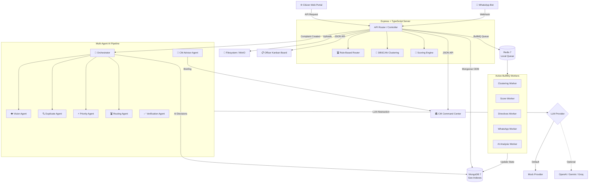

# 🏛️ Delhi Governance Intelligence Platform (DGIP)

> **CM Command Center** — Real-time Civic Operations Intelligence, Multi-Agent AI Governance, Spatial DBSCAN Clustering, and Citizen-Veto Accountability for the Delhi Chief Minister's Office.

[](https://github.com/FreezinGaits/delhi-cm-grievance-dashboard/actions)

---

## 🌟 The Vision

Standard grievance portals suffer from three fatal flaws:

1. **Desk-Based Fraud:** Officers mark complaints as "resolved" without doing the actual work on the ground.
2. **Duplicate Clutter:** One pothole gets reported by 50 different citizens, clogging the system and wasting public funds.
3. **No Leadership Visibility:** Decision-makers lack real-time geospatial intelligence to spot systemic issues and hold officers accountable.

**DGIP** solves these challenges by introducing a **WhatsApp-first intake engine**, **geospatial DBSCAN clustering**, **on-the-go CM field directives**, and a strict **Citizen Veto** loop where no ticket is closed until the citizen verifies the resolution with evidence.

---

## 🚀 2-Minute Judge Quick Start (Zero-Config Mock Mode)

We have built a robust **Mock Mode** for all external integrations. If credentials (like Meta WhatsApp API, SMS Gateway, or MinIO AWS Storage) are left empty, the application runs entirely locally with zero configuration. No external account setup is required.

### Prerequisites

- **Node.js** v20 or higher
- **Docker Desktop** (to run the local Redis queue engine)
- **MongoDB** (running locally on port `27017` or via Docker)

### Installation & Run

1. **Clone the Repository:**

   ```bash
   git clone https://github.com/FreezinGaits/delhi-cm-grievance-dashboard.git
   cd delhi-cm-grievance-dashboard
   ```

2. **Prepare Environment Settings:**

   ```bash
   cp .env.example .env
   ```

   _(Note: The default `.env` is pre-configured to use your local Redis container and local MongoDB)._

3. **Install Dependencies:**

   ```bash
   npm install --ignore-scripts
   cd backend && npm install && cd ..
   cd frontend && npm install && cd ..
   ```

4. **Start the Infrastructure:**
   Ensure Docker Desktop is open, then start the local Redis cache/queue:

   ```bash
   docker compose up -d redis
   ```

5. **Seed the Database:**
   Populate local MongoDB with departments, dummy officers, and sample complaints:

   ```bash
   cd backend && npx tsx src/scripts/seed.ts && cd ..
   ```

6. **Launch the Application:**
   Start the frontend and backend servers concurrently:
   ```bash
   npm run dev
   ```
   - **Frontend Command Center:** [http://localhost:3005](http://localhost:3005) (or `3000`)
   - **Backend API Server:** [http://localhost:5000](http://localhost:5000)

---

## 🎭 Step-by-Step Judge Walkthrough

Use these demo accounts to explore the unified workflow:

| Role        | Email                       | Password       | What to Test                                                                                                  |
| ----------- | --------------------------- | -------------- | ------------------------------------------------------------------------------------------------------------- |
| **Citizen** | `rohit.kumar@gmail.com`     | `Password123!` | Submit a new complaint with location Karol Bagh; track its status; veto or confirm resolution.                |
| **CM**      | `cm@delhi.gov.in`           | `Password123!` | View real-time Heatmaps, track Officer Rankings, launch Field Visit Mode, and issue Spot Directives.          |
| **Officer** | `rajesh.verma@delhi.gov.in` | `Password123!` | View assigned complaints on the Kanban board, mark as "In Progress", and upload evidence to mark as resolved. |

---

## 🗺️ System Architecture



---

## 🧠 Core Algorithmic Engines

### 1. WhatsApp State Machine (Stateful Intake)

Citizens do not need to download apps. The Meta WhatsApp integration uses a robust state engine to guide citizens step-by-step:

- **State 0 (Idle):** Send "Hi" or "Madad" to start.
- **State 1 (Name):** Capture citizen's name.
- **State 2 (Location):** Share GPS pin. Wards are automatically mapped using geo-boundaries (Karol Bagh, Dwarka, etc.) with clean text fallback.
- **State 3 (Category):** Pick category (Water Leak, Pot Hole, Electricity, etc.).
- **State 4 (Details):** Capture voice/text details and upload media proof.
- **State 5 (Confirmation):** Review details and issue the reference tracking ID.

### 2. DBSCAN Spatial Clustering

To prevent duplicate tickets from clogging the system, a background queue worker runs a DBSCAN (Density-Based Spatial Clustering of Applications with Noise) algorithm:

- **Parameters:** Searches within a radius of `100 meters` and checks for text similarity (using Levenshtein distance/TF-IDF matches on description).
- **Consolidation:** If duplicates are found, they are merged under a **Master Incident**.
- **Integrity:** The individual citizens are linked as subscribers to the Master Ticket. When the officer resolves the Master Ticket, all subscribed citizens are notified simultaneously.

### 3. The Officer Accountability Score

To remove subjectivity, officer performance is mathematically rated from `0 to 100` using a composite score calculated daily at midnight:

$$\text{Score} = (W_1 \times \text{SLA Compliance Rate}) + (W_2 \times \text{Citizen Approval Rate}) - (W_3 \times \text{Citizen Veto Rate}) - (W_4 \times \text{Workload Penalty})$$

- **SLA Compliance (40%):** Percentage of tickets resolved within the department's SLA window.
- **Citizen Approval (40%):** Rate of resolutions confirmed by citizens.
- **Citizen Veto (20% penalty):** Substantial penalty applied when citizens reject the officer's resolution proof and reopen tickets.
- **Overload Penalty:** Small deduction applied if the officer exceeds their resource bandwidth capacity.

### 4. Field Visit Mode & CM Spot Directives

When the CM is on on-ground inspections, the dashboard shifts into **Field Visit Mode**:

- **Live GPS Radius:** Identifies open complaints within `500m`, `1km`, or `2km` of the CM's location.
- **Spot Directives:** The CM can tap on a nearby complaint or create a new one, assigning it directly to the department head on-spot with a strict countdown timer (e.g., "Fix this manhole in 24 hours").
- **SLA bypass:** Spot directives are routed to a high-priority queue and trigger instant notifications.

---

## 🤖 Agentic AI Governance Layer

The platform features a **multi-agent AI system** with 6 specialized agents coordinated by a central orchestrator. Every agent is independently feature-flagged and falls back to a deterministic `MockProvider` when no LLM API key is configured.

### Agent Pipeline (triggered on every new complaint)

```text
Complaint → 👁️ Vision → 🔍 Duplicate → ⚡ Priority → 🛣️ Routing → 💾 DB Update
```

| Agent | Purpose | Key Capability |
|-------|---------|----------------|
| **👁️ Vision** | Analyzes complaint images | Detects category, severity, hazards from photos |
| **🔍 Duplicate** | Semantic duplicate detection | Enhances DBSCAN with LLM-based semantic comparison |
| **⚡ Priority** | Urgency assessment | Multi-factor scoring (0-100) with SLA recommendation |
| **🛣️ Routing** | Department assignment | Suggests primary + secondary departments |
| **✅ Verification** | Resolution validation | Checks officer evidence before citizen review |
| **🧠 CM Advisor** | Executive intelligence | Generates morning briefings from real database state |

### Design Principles

- **Provider Agnostic:** `LLMProvider` interface supports OpenAI, Gemini, Groq, or Mock — toggled via `AI_PROVIDER` env var.
- **Zero-Dependency Default:** `MockProvider` returns deterministic responses — no API keys required to run the full pipeline.
- **Human-in-the-Loop:** AI suggestions only *upgrade* priorities (never downgrade) and always require human confirmation.
- **Full Audit Trail:** Every agent decision is logged to `AgentDecision` collection with model, confidence, reasoning, and execution time.
- **Async Processing:** Heavy analysis runs on a dedicated `ai-analysis` BullMQ worker, keeping API responses fast.

### Agent API Endpoints

| Method | Endpoint | Description |
|--------|----------|-------------|
| `POST` | `/api/v1/agents/analyze` | Run full AI pipeline on a complaint |
| `POST` | `/api/v1/agents/reverify` | Re-verify resolution evidence |
| `GET` | `/api/v1/agents/advisor` | Generate CM executive briefing |
| `GET` | `/api/v1/agents/history/:id` | Get AI decision audit trail |
| `POST` | `/api/v1/agents/test` | Test pipeline with synthetic data |

## 📡 API Reference & Architecture Documentation

All features and schemas are fully documented in the `docs/` folder:

- 📚 **[System Architecture](docs/SYSTEM_ARCHITECTURE.md)** — Detailed multi-tier network and data flow architecture.
- 🗃️ **[Database Design](docs/DATABASE_DESIGN.md)** — Detailed MongoDB schema structures for all 15 models.
- 📶 **[API Specifications](docs/API_SPECIFICATION.md)** — Full request/response definitions for every endpoint.
- 📱 **[WhatsApp Intake Architecture](docs/WHATSAPP_ARCHITECTURE.md)** — State machine mechanics and sequence diagrams.
- 🧠 **[DBSCAN Clustering Engine](docs/CLUSTERING_ARCHITECTURE.md)** — Mathematical breakdown of geospatial duplicate merging.
- 🏅 **[Accountability Scoring Engine](docs/ACCOUNTABILITY_ENGINE.md)** — Complete scoring algorithm weights and calculations.
- 🔒 **[Security Architecture](docs/SECURITY_ARCHITECTURE.md)** — Implementation of RBAC, rate-limiting, and brute force protection.

---

## 🛠️ Technology Stack

- **Frontend:** Next.js 15 App Router, React 19, TypeScript, Vanilla CSS, Recharts, Leaflet Maps
- **Backend:** Node.js, Express.js, TypeScript, Mongoose ODM
- **AI Layer:** Multi-Agent Orchestrator, LLM Provider Abstraction (Mock/OpenAI/Gemini/Groq)
- **Cache & Queues:** Redis 7, BullMQ (7 active worker queues including AI Analysis)
- **Storage:** MinIO (Local S3-compatible Object Store) or AWS S3
- **Testing:** Jest, Supertest (42 tests across 4 suites)

---

## 📁 Repository structure

```text
delhi-cm-grievance-dashboard/
├── backend/                  # Express REST API Server
│   ├── src/
│   │   ├── agents/          # 🤖 Agentic AI layer
│   │   │   ├── shared/      # LLM provider & type definitions
│   │   │   ├── vision/      # Image analysis agent
│   │   │   ├── duplicate/   # Semantic duplicate detection
│   │   │   ├── priority/    # Multi-factor urgency scoring
│   │   │   ├── routing/     # AI department assignment
│   │   │   ├── verification/# Resolution evidence validation
│   │   │   ├── advisor/     # CM executive briefing engine
│   │   │   └── orchestrator/# Central pipeline coordinator
│   │   ├── config/          # Environment configuration & databases
│   │   ├── controllers/     # Route handlers
│   │   ├── middleware/      # Auth, RBAC, rate-limiting, and error-handlers
│   │   ├── models/          # 17 Mongoose schemas (incl. AIAnalysis, AgentDecision)
│   │   ├── routes/          # REST route endpoints (incl. agents.routes)
│   │   ├── services/        # Scoring, clustering, and WhatsApp engines
│   │   └── workers/         # BullMQ queue background workers (7 queues)
├── frontend/                 # Next.js 15 command center frontend
│   └── src/app/
│       ├── components/      # AI Briefing Widget, AI Analysis Badge
│       ├── dashboard/
│       │   ├── cm/          # Command center (AI Briefing, Heatmaps, Rankings)
│       │   ├── officer/     # Kanban workflow board & evidence portal
│       │   └── citizen/     # Web intake & ticket tracking
└── docs/                     # Visual design and engine specifications
```

---

_Built for the Delhi Government Chief Minister's Command Center Demo._
