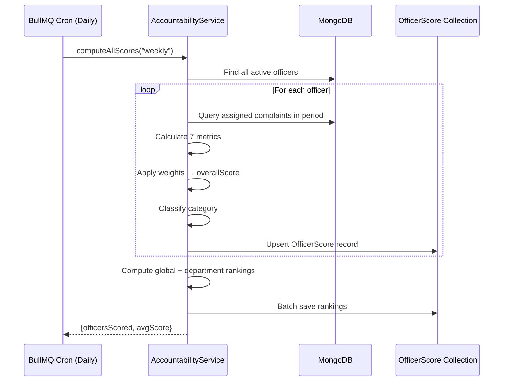

# Accountability Score Engine — Architecture

## Purpose

Provide the Chief Minister with quantitative visibility into officer performance. Each officer receives a weighted score (0–100) computed from real complaint resolution data.

## Score Computation

### Metrics & Weights

| Metric | Weight | Scoring Method |
|--------|--------|----------------|
| Resolution Rate | 25% | (resolved / total) × 100 |
| Citizen Satisfaction | 20% | (avg_rating / 5) × 100 |
| SLA Compliance | 20% | (within_deadline / total_with_sla) × 100 |
| Avg Resolution Time | 15% | 100 × (1 − hours / 168) |
| Escalation Penalty | 10% | 100 − (escalated / total) × 200 |
| Rejection Penalty | 5% | 100 − (rejected / total) × 200 |
| Critical Case Performance | 5% | (critical_resolved / critical_total) × 100 |

### Category Classification

| Score Range | Category | Color |
|------------|----------|-------|
| 85–100 | Excellent | 🟢 Green |
| 65–84 | Good | 🔵 Blue |
| 40–64 | Needs Attention | 🟡 Yellow |
| 0–39 | Critical | 🔴 Red |

## Data Model: OfficerScore

| Field | Type | Description |
|-------|------|-------------|
| officerId | ObjectId | Officer user reference |
| departmentId | ObjectId | Department reference |
| period | Object | {type, startDate, endDate} |
| metrics | Object | Individual metric values |
| overallScore | Number | Weighted composite (0–100) |
| category | Enum | excellent / good / needs_attention / critical |
| departmentRank | Number | Rank within department |
| globalRank | Number | Rank across all officers |
| totalComplaintsHandled | Number | Volume for the period |
| trend | Number | Score delta vs prior period |

## Scoring Flow



## API Endpoints

| Method | Endpoint | Description |
|--------|----------|-------------|
| GET | `/api/v1/governance/officer-rankings` | Ranked list (top/bottom performers) |
| GET | `/api/v1/governance/officer-score/:id` | Single officer's performance history |
| POST | `/api/v1/governance/compute-scores` | Trigger manual score computation |

### Query Parameters for Rankings

| Param | Values | Default |
|-------|--------|---------|
| period | weekly, monthly, quarterly | weekly |
| sortBy | top, bottom | top |
| departmentId | ObjectId | (all departments) |
| limit | 1–100 | 20 |

## Dashboard Display

```
┌────────────────────────────────────────────────────┐
│  🏅 Officer Rankings — This Week                    │
│  ─────────────────────────────────────────────────  │
│  #1  Priya Singh      (DJB)    Score: 92  🟢 ↑+5  │
│  #2  Rajesh Verma     (PWD)    Score: 87  🟢 ↑+2  │
│  #3  Amit Gupta       (MCD)    Score: 71  🔵 ↓-3  │
│  #4  Kavita Rao       (BSES)   Score: 58  🟡 ↑+8  │
│  #5  Neha Sharma      (POLICE) Score: 34  🔴 ↓-12 │
│  ─────────────────────────────────────────────────  │
│  Average Score: 68.4 | Officers Scored: 20          │
└────────────────────────────────────────────────────┘
```

## Scheduling

- **Daily at midnight**: Compute weekly scores (BullMQ cron)
- **On-demand**: CM can trigger via dashboard or API
