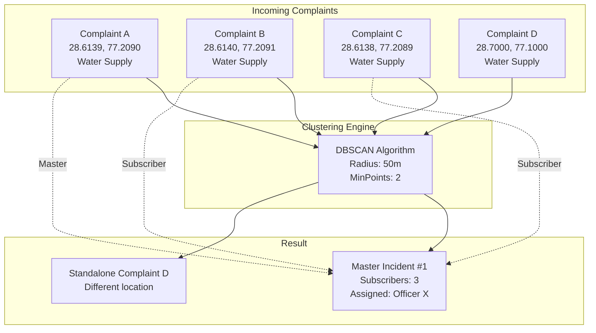

# Master Incident Clustering — Architecture

## Problem Statement

When a water main bursts on a busy road, 100+ citizens may independently report the same issue. Without clustering, the system would create 100 separate tickets, assign multiple officers, and waste resources on duplicate dispatch.

## Solution: DBSCAN Spatial Clustering

The clustering engine groups complaints that share:
- **Same category** (e.g., Water Supply)
- **Within 50-meter radius**
- **Unresolved status**

into a single **Master Incident** for operational workflow, while keeping individual citizen tickets visible for transparency.

## Architecture



## Data Model: ComplaintCluster

| Field | Type | Description |
|-------|------|-------------|
| masterComplaintId | ObjectId | The first/primary complaint in the cluster |
| subscriberComplaintIds | ObjectId[] | All other complaints in the cluster |
| subscriberCitizenIds | ObjectId[] | Unique citizens who reported |
| location | GeoJSON Point | Center point of the cluster |
| category | String | Shared complaint category |
| radius | Number | Cluster radius in meters (default: 50) |
| complaintCount | Number | Total complaints in cluster |
| status | Enum | active / resolved / closed |

## Algorithm

```
FOR each unclustered, unresolved complaint:
  1. Check if it's within 50m of an existing active cluster (same category)
     → YES: Add to that cluster
     → NO: Search for neighbors within 50m in the same category
       → Found ≥ 2: Create new cluster with this as master
       → Found < 2: Leave as standalone
```

## Scheduling

The clustering engine runs:
- **Every 15 minutes** via BullMQ cron job
- **On-demand** via `POST /api/v1/governance/run-clustering` (CM/Admin only)

## Dashboard Display

```
┌─────────────────────────────────────────────────┐
│  Master Incident: Pothole on Ring Road          │
│  ──────────────────────────────────────────────  │
│  Subscribers: 127 Citizens                      │
│  Open Complaints: 127                           │
│  Officer Assigned: Rajesh Verma (PWD)           │
│  Location: Karol Bagh (28.6514°N, 77.1907°E)   │
│  Status: In Progress                            │
│  [View All Complaints] [Assign Officer]         │
└─────────────────────────────────────────────────┘
```

## API Endpoints

| Method | Endpoint | Description |
|--------|----------|-------------|
| GET | `/api/v1/governance/clusters` | List active clusters |
| GET | `/api/v1/governance/clusters/:id` | Cluster details with all complaints |
| POST | `/api/v1/governance/run-clustering` | Trigger manual clustering run |
