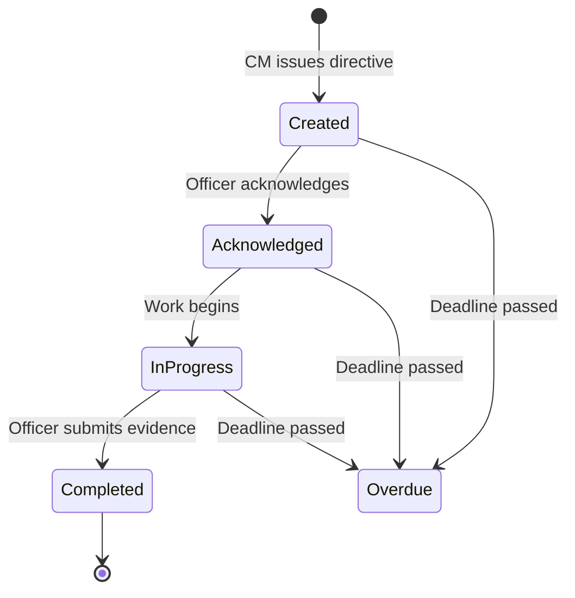
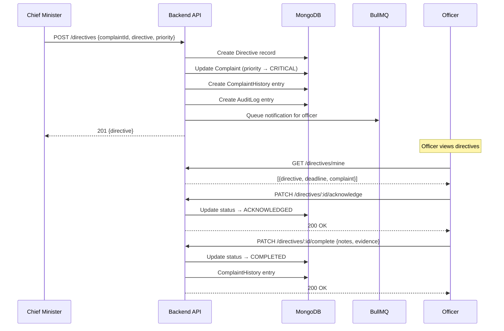

# CM Spot Directives — Architecture

## Purpose

Allow the Chief Minister to issue directives during field visits or while reviewing complaints. Directives automatically elevate complaint priority, notify assigned officers and department heads, and track a full lifecycle.

## Directive Lifecycle

## Data Model: Directive

| Field | Type | Description |
|-------|------|-------------|
| complaintId | ObjectId | Linked complaint |
| directive | String | CM's instruction text |
| issuedBy | ObjectId | CM user reference |
| assignedOfficer | ObjectId | Auto-populated from complaint |
| assignedDepartment | ObjectId | Auto-populated from complaint |
| priority | Enum | immediate (4h) / within_24h / within_week |
| status | Enum | created / acknowledged / in_progress / completed / overdue |
| deadline | Date | Computed from priority |
| acknowledgedAt | Date | When officer acknowledged |
| completedAt | Date | When work was completed |
| completionNotes | String | Officer's completion report |
| completionEvidence | Array | Photo/document evidence |
| statusHistory | Array | Full state change audit trail |

## Priority Deadlines

| Priority | Deadline | Use Case |
|----------|----------|----------|
| `immediate` | 4 hours | Life-threatening situations |
| `within_24h` | 24 hours | Urgent civic issues |
| `within_week` | 7 days | Non-urgent improvements |

## Side Effects

When a directive is issued:
1. Complaint priority → `CRITICAL`
2. `spotDirective` field populated on the complaint
3. `ComplaintHistory` entry with `DIRECTIVE_ISSUED` action
4. `AuditLog` entry for governance trail
5. Assigned officer and department head notified (future: via WhatsApp/push)

## API Endpoints

| Method | Endpoint | Access | Description |
|--------|----------|--------|-------------|
| POST | `/api/v1/directives` | CM | Issue new directive |
| GET | `/api/v1/directives` | CM | List all directives |
| GET | `/api/v1/directives/stats` | CM | Dashboard summary stats |
| GET | `/api/v1/directives/mine` | Officers | My assigned directives |
| PATCH | `/api/v1/directives/:id/acknowledge` | Officers | Acknowledge directive |
| PATCH | `/api/v1/directives/:id/start` | Officers | Mark in progress |
| PATCH | `/api/v1/directives/:id/complete` | Officers | Complete with evidence |

## Overdue Detection

A BullMQ cron job runs **every hour** to scan for directives that have passed their deadline but are not yet completed. These are automatically marked `OVERDUE` and logged.

## Sequence Diagram

