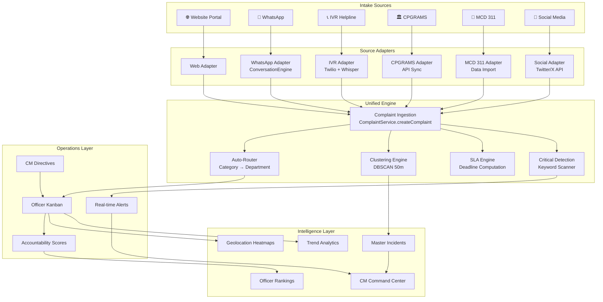

# Delhi Governance Intelligence Platform — Unified Architecture

## Rebranding Notice

> This platform is **no longer a grievance portal**. It is the **Delhi Governance Intelligence Platform** — a command center for real-time civic operations intelligence.

## Unified Complaint Engine

All intake sources feed into a single, unified complaint processing pipeline. The `ComplaintSource` enum already supports:

```typescript
enum ComplaintSource {
  WEB = 'web',           // ✅ Implemented
  WHATSAPP = 'whatsapp', // ✅ Implemented (Phase A)
  SMS = 'sms',           // 🔮 Future
  HELPLINE = 'helpline', // 🔮 Future (IVR)
  SOCIAL_MEDIA = 'social_media', // 🔮 Future
  WALK_IN = 'walk_in',   // 🔮 Future
}
```

## Source Abstraction Layer



## Future Source Integrations

### IVR Helpline (Phone Calls)
- **Technology**: Twilio Voice + OpenAI Whisper
- **Flow**: Citizen calls → IVR menu → Voice recording → Whisper transcription → `ComplaintService.createComplaint(source: HELPLINE)`
- **Env vars**: `TWILIO_ACCOUNT_SID`, `TWILIO_AUTH_TOKEN`, `OPENAI_API_KEY`

### CPGRAMS Integration
- **Technology**: Government API gateway polling
- **Flow**: Scheduled sync job → Fetch new CPGRAMS entries → Map to internal schema → Create complaints
- **Deduplication**: Match by citizen phone + location + category within 24h window

### MCD 311 Integration
- **Technology**: CSV/API batch import
- **Flow**: Daily data dump → Parse → Map categories → Create complaints

### Social Media Monitoring
- **Technology**: Twitter/X API v2 + NLP classification
- **Flow**: Stream mentions of @DelhiGov → NLP classifies as grievance → Auto-create complaint → DM citizen for location/details

## Key Design Principles

1. **Single Schema**: All sources create the same `Complaint` document. No source-specific models.
2. **Source Tracking**: Every complaint records its `source` field for analytics.
3. **Adapter Pattern**: Each source has its own adapter module that normalizes input into the shared `CreateComplaintData` interface.
4. **Audit Trail**: Every interaction from every source is logged to `AuditLog`.
5. **Mock-First**: All external integrations operate in mock mode when credentials are absent.

## Platform Capabilities Matrix

| Capability | Web | WhatsApp | IVR | CPGRAMS | MCD 311 | Social |
|-----------|-----|----------|-----|---------|---------|--------|
| File Complaint | ✅ | ✅ | 🔮 | 🔮 | 🔮 | 🔮 |
| Track Complaint | ✅ | ✅ | 🔮 | — | — | — |
| Upload Evidence | ✅ | ✅ | — | — | — | — |
| GPS Lock | ✅ | ✅ | — | — | — | — |
| Status Updates | ✅ | ✅ | 🔮 | — | — | 🔮 |
| Citizen Veto | ✅ | 🔮 | — | — | — | — |
