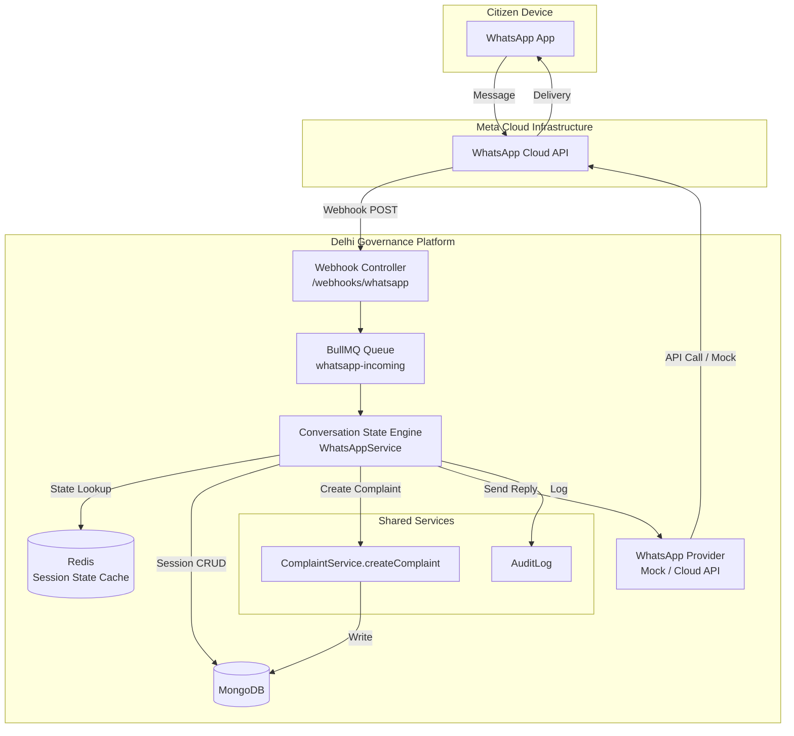
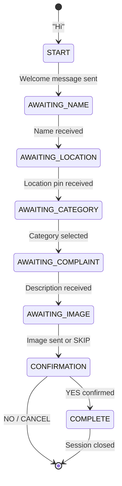

# WhatsApp Grievance Intake — System Architecture

## Overview

The WhatsApp intake channel enables citizens to file grievances entirely through WhatsApp without visiting the web portal. It is a **first-class intake source** that feeds into the same unified complaint engine used by the website.

## Architecture Diagram

## Data Models

### WhatsAppSession
Tracks the conversational state for each phone number.

| Field | Type | Description |
|-------|------|-------------|
| phoneNumber | String | Citizen's WhatsApp phone number |
| citizenId | ObjectId | Linked User record (created on first complaint) |
| currentConversationState | Enum | Current step in the intake flow |
| conversationData | Object | Accumulated form data (name, location, category, description, mediaUrl) |
| lastMessageAt | Date | Timestamp of last interaction |
| isActive | Boolean | Whether session is still in progress |
| messageCount | Number | Total messages in this session |

### WhatsAppMessage
Full audit trail of every message sent and received.

| Field | Type | Description |
|-------|------|-------------|
| sender | String | Phone number or "system" |
| receiver | String | Phone number or "system" |
| direction | Enum | inbound / outbound |
| messageType | Enum | text / image / location / document / audio |
| content | String | Message body text |
| mediaUrl | String | URL to downloaded media |
| waMessageId | String | Meta Cloud API message ID |
| locationData | Object | Lat/lng from location messages |
| deliveryStatus | Enum | sent / delivered / read / failed |

## Conversation State Machine

## Global Commands

Available in **any** conversation state:

| Command | Action |
|---------|--------|
| `HELP` | Display available commands |
| `STATUS` / `MY COMPLAINTS` | List citizen's recent complaints |
| `TRACK <REF>` | Track a specific complaint by reference number |
| `CANCEL` | Cancel current session |

## Mock Mode

When `WHATSAPP_ACCESS_TOKEN` is not set in the environment, the system operates in **mock mode**:
- All outbound messages are logged to the console with `[WhatsApp Mock]` prefix
- Media downloads return stub data
- The `/webhooks/whatsapp/test` endpoint allows simulating conversations without Meta integration

## BullMQ Workers

| Queue | Purpose | Concurrency |
|-------|---------|-------------|
| `whatsapp-incoming` | Process incoming messages | 5 |
| `whatsapp-media` | Download media attachments | 1 |
| `whatsapp-notify` | Send status update notifications | 10 |
