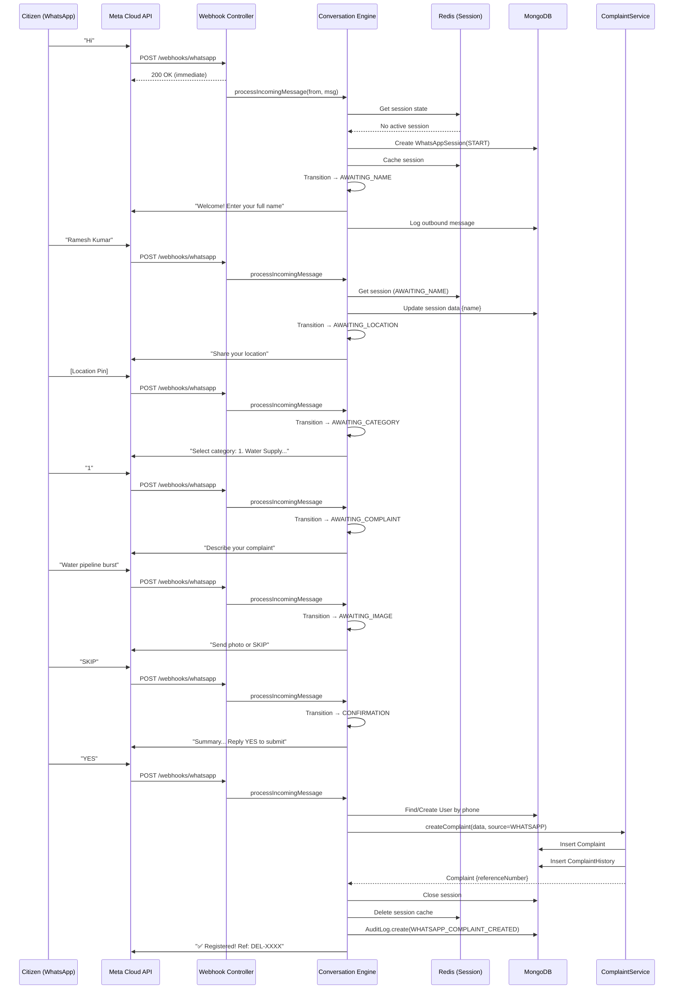
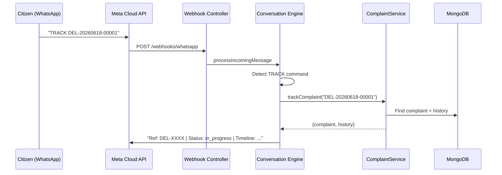
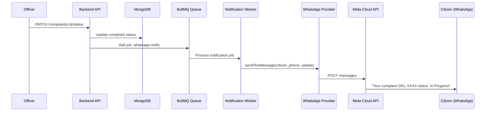
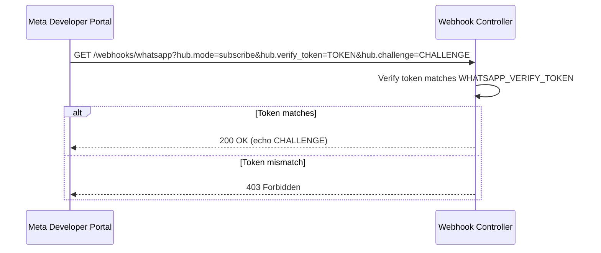

# WhatsApp Intake — Sequence Diagrams

## 1. Complaint Filing Flow

```mermaid
sequenceDiagram
  participant C as Citizen (WhatsApp)
  participant M as Meta Cloud API
  participant W as Webhook Controller
  participant E as Conversation Engine
  participant R as Redis (Session)
  participant DB as MongoDB
  participant CS as ComplaintService

  C->>M: "Hi"
  M->>W: POST /webhooks/whatsapp
  W-->>M: 200 OK (immediate)
  W->>E: processIncomingMessage(from, msg)
  E->>R: Get session state
  R-->>E: No active session
  E->>DB: Create WhatsAppSession(START)
  E->>R: Cache session
  E->>E: Transition → AWAITING_NAME
  E->>M: "Welcome! Enter your full name"
  E->>DB: Log outbound message

  C->>M: "Ramesh Kumar"
  M->>W: POST /webhooks/whatsapp
  W->>E: processIncomingMessage
  E->>R: Get session (AWAITING_NAME)
  E->>DB: Update session data {name}
  E->>E: Transition → AWAITING_LOCATION
  E->>M: "Share your location"

  C->>M: [Location Pin]
  M->>W: POST /webhooks/whatsapp
  W->>E: processIncomingMessage
  E->>E: Transition → AWAITING_CATEGORY
  E->>M: "Select category: 1. Water Supply..."

  C->>M: "1"
  M->>W: POST /webhooks/whatsapp
  W->>E: processIncomingMessage
  E->>E: Transition → AWAITING_COMPLAINT
  E->>M: "Describe your complaint"

  C->>M: "Water pipeline burst"
  M->>W: POST /webhooks/whatsapp
  W->>E: processIncomingMessage
  E->>E: Transition → AWAITING_IMAGE
  E->>M: "Send photo or SKIP"

  C->>M: "SKIP"
  M->>W: POST /webhooks/whatsapp
  W->>E: processIncomingMessage
  E->>E: Transition → CONFIRMATION
  E->>M: "Summary... Reply YES to submit"

  C->>M: "YES"
  M->>W: POST /webhooks/whatsapp
  W->>E: processIncomingMessage
  E->>DB: Find/Create User by phone
  E->>CS: createComplaint(data, source=WHATSAPP)
  CS->>DB: Insert Complaint
  CS->>DB: Insert ComplaintHistory
  CS-->>E: Complaint {referenceNumber}
  E->>DB: Close session
  E->>R: Delete session cache
  E->>DB: AuditLog.create(WHATSAPP_COMPLAINT_CREATED)
  E->>M: "✅ Registered! Ref: DEL-XXXX"
```

## 2. Complaint Tracking Flow

```mermaid
sequenceDiagram
  participant C as Citizen (WhatsApp)
  participant M as Meta Cloud API
  participant W as Webhook Controller
  participant E as Conversation Engine
  participant CS as ComplaintService
  participant DB as MongoDB

  C->>M: "TRACK DEL-20260618-00001"
  M->>W: POST /webhooks/whatsapp
  W->>E: processIncomingMessage
  E->>E: Detect TRACK command
  E->>CS: trackComplaint("DEL-20260618-00001")
  CS->>DB: Find complaint + history
  CS-->>E: {complaint, history}
  E->>M: "Ref: DEL-XXXX | Status: in_progress | Timeline: ..."
```

## 3. Status Update Notification (Outbound)

```mermaid
sequenceDiagram
  participant O as Officer
  participant API as Backend API
  participant DB as MongoDB
  participant Q as BullMQ Queue
  participant W as Notification Worker
  participant P as WhatsApp Provider
  participant M as Meta Cloud API
  participant C as Citizen (WhatsApp)

  O->>API: PATCH /complaints/:id/status
  API->>DB: Update complaint status
  API->>Q: Add job: whatsapp-notify
  Q->>W: Process notification job
  W->>P: sendTextMessage(citizen_phone, update)
  P->>M: POST /messages
  M->>C: "Your complaint DEL-XXXX status: In Progress"
```

## 4. Meta Webhook Verification

```mermaid
sequenceDiagram
  participant META as Meta Developer Portal
  participant W as Webhook Controller

  META->>W: GET /webhooks/whatsapp?hub.mode=subscribe&hub.verify_token=TOKEN&hub.challenge=CHALLENGE
  W->>W: Verify token matches WHATSAPP_VERIFY_TOKEN
  alt Token matches
    W-->>META: 200 OK (echo CHALLENGE)
  else Token mismatch
    W-->>META: 403 Forbidden
  end
```
